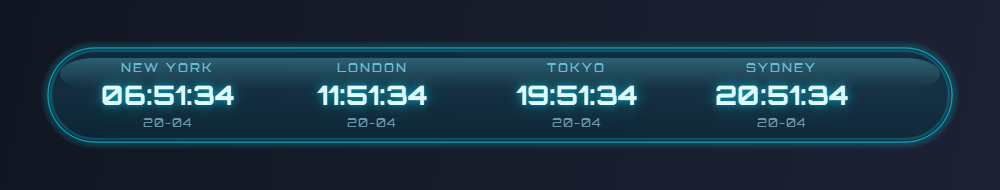

# World Clock

A small translucent desktop widget for Windows 10/11 that shows the current time in 4 to 6 cities at once.



---

## How to install it (2 clicks)

> **Please do not press the green "Code" button at the top of this page.** That downloads the source code for developers and will not run on its own. Follow the steps below instead.

1. Go to the **[Releases page](../../releases)** (right sidebar of this GitHub page, or click the link).
2. Under the newest release, download the file named **`WorldClock-v1.x.y.zip`**.
3. Find the downloaded zip in your **Downloads** folder. **Right-click** it and choose **Extract All...** → **Extract**. This creates a `WorldClock-v1.x.y` folder.
4. Open that folder and **double-click `Install.bat`**.

The installer:
- creates a **World Clock** icon on your Desktop,
- asks whether to start it automatically when Windows boots (Y/N),
- asks whether to launch it right now (Y/N).

That is the whole setup. **You do not need to install Python** — the release zip already contains everything the app needs.

### To run the widget

Double-click the **World Clock** icon on your Desktop.

### To change which cities are shown

- **Hover** the widget to reveal four small buttons on the right-hand side.
- Click **+** to add a city, **−** to remove the last one (4 to 6 cities supported).
- Click any **city name** to open the picker and swap that slot's timezone.

### To move the widget

Click and drag anywhere on the pill. The position is remembered between launches.

### To close / uninstall

- **Close for now**: hover the widget, click the red **×** button.
- **Remove completely**: go to the install folder (the one you extracted) and double-click **`Uninstall.bat`**. It removes the Desktop shortcut, the startup entry, and (optionally) your saved settings. Afterwards, delete the folder.

### To update to a newer version

1. Run `Uninstall.bat` in the old folder.
2. Delete the old folder.
3. Download and extract the newer zip, run its `Install.bat`.

---

## Troubleshooting

| Problem | Fix |
|---|---|
| **SmartScreen dialog "Windows protected your PC"** when opening `Install.bat` | Click **More info** → **Run anyway**. The zip only contains batch files, a VBScript, and a Python runtime — no signed .exe that Microsoft has built reputation against. |
| **Install.bat says "expects a self-contained build with a runtime subfolder"** | You only extracted *part* of the zip, or you downloaded the source instead of a release. Delete what you extracted, re-extract the full zip, and run Install.bat from there. |
| **Desktop shortcut does nothing when double-clicked** | Open the install folder and run `Launch.vbs` directly. If that fails too, run `Uninstall.bat` then re-extract the zip. |
| **Widget is invisible / behind everything** | That's by design — the widget sits on the background so it does not interrupt your work. Minimise open windows (**Win + D**) to see it. |
| **Widget is off-screen after changing monitors** | Delete `config.json` in the install folder, then launch again. It resets to the top-centre of your primary display. |

---

## What the widget shows

- City names in **uppercase cyan** with letter-spacing (Orbitron font).
- Time in 24-hour `HH:MM:SS` with a soft cyan neon glow.
- Date in `DD-MM`.
- If a configured city is within **7 days of a DST fall-back** (clocks going back to standard time), a **magenta `DST ENDS IN N DAYS`** line appears under the date.

---

## For developers

You only need this section if you want to modify the code or build releases yourself.

### Run from source
```bash
pip install -r requirements.txt
python main_qt.py
```

### Build the release zip locally
```powershell
powershell -ExecutionPolicy Bypass -File build\build_bundle.ps1 -Version v1.0.0
powershell -Command "Compress-Archive 'dist\WorldClock-v1.0.0\*' 'dist\WorldClock-v1.0.0.zip'"
```
Output: `dist\WorldClock-v1.0.0.zip` — drag that into a GitHub Release.

### Automated release
Pushing a `v*` tag triggers `.github/workflows/release.yml`, which:
1. smoke-tests the widget on a Windows runner,
2. runs `build_bundle.ps1`,
3. attaches the resulting zip to a new GitHub Release.

```bash
git tag v1.0.1
git push origin v1.0.1
```

### Microsoft Store packaging
See [STORE_SUBMISSION.md](STORE_SUBMISSION.md) and `build/build_msix.ps1`.

### Project layout
```
main_qt.py            entry point
src/                  clock manager, widget, city selector
assets/cities.json    130+ city → timezone mapping
assets/fonts/         bundled Orbitron font (SIL OFL 1.1)
build/                icon + bundle + MSIX build scripts
Install.bat           shortcut creator for end users
Launch.vbs            silent launcher (no console flash)
Uninstall.bat         removes shortcuts + kills running widget
```

### License

Application code is MIT unless noted otherwise. The bundled **Orbitron** font is licensed under the SIL Open Font License 1.1 — see `assets/fonts/OFL.txt`.
