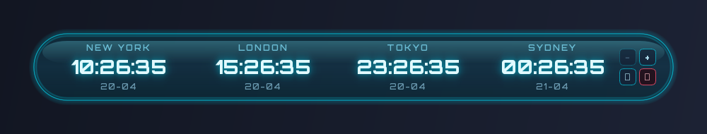
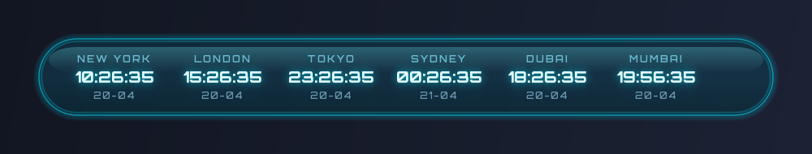
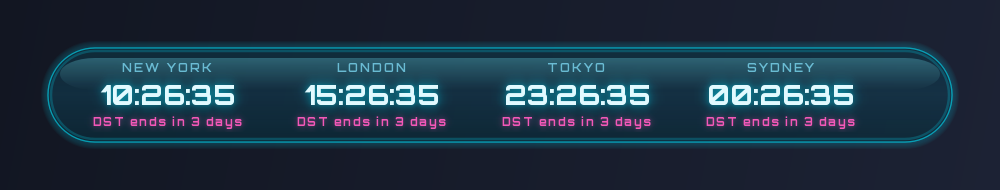

# World Clock

A translucent cyberpunk desktop widget for Windows 10 and 11 that shows the current time in 4 to 6 cities at once.


<details>
<summary><b>More screenshots</b></summary>

**On hover** — reveals the +/- (add/remove city) and settings/close buttons inside the right curve:


**With 6 cities (maximum):**


**DST alert** — shown 7 days before a fall-back transition, replaces the date in magenta:


</details>

---

## I just want to use the widget

> ⚠️ **Do not press the green "Code" button at the top of this page.** That gives you the source code for developers, not a ready-to-run program. Follow the four steps below instead.

### Step 1 — Open the Releases page

- On this GitHub page, look at the **right-hand sidebar**. Find the section titled **"Releases"** and click it.
- Or click this direct link: **[Releases page](../../releases)**.

### Step 2 — Download the zip

- Under the **latest** release (top of the list), find a file named **`WorldClock-v1.x.y.zip`** (the `x.y` will be numbers).
- Click the filename. Windows saves it to your **Downloads** folder.

### Step 3 — Extract the zip

- Open the **Downloads** folder in File Explorer.
- **Right-click** the `WorldClock-v1.x.y.zip` file → **Extract All…** → click **Extract** in the dialog.
- This creates a new folder called **`WorldClock-v1.x.y`** right next to the zip. You can move this folder anywhere you like (e.g. to your Documents folder) — just keep everything inside it together.

### Step 4 — Run the installer

- Open the extracted **`WorldClock-v1.x.y`** folder.
- **Double-click `Install.bat`**.
- A small black window opens. It asks two simple questions:
  - *"Launch World Clock when Windows starts? [Y/N]"* — press **Y** to start the clock automatically every time you log in, or **N** to keep it off.
  - *"Launch World Clock right now? [Y/N]"* — press **Y** to see the widget immediately.
- When you see *"Done."*, press any key to close the window.

✅ You now have a **World Clock** icon on your Desktop. **Double-click it any time to show the widget.**

**You did not need to install Python, visit any website during the install, or click through any SmartScreen warnings** — the zip already contains everything needed.

> 🛡 **If you DO see a SmartScreen dialog saying "Windows protected your PC"** when you run `Install.bat`: click **More info** → **Run anyway**. This happens because the installer is not yet signed with a code-signing certificate (a hobby project can't justify the $200/year fee). The zip only contains plain text batch files, a VBScript, and a Python runtime — nothing to worry about.

---

## Using the widget

### Show the widget
Double-click the **World Clock** icon on your Desktop.

### Move it around the screen
Click and drag anywhere on the pill. The widget remembers where you put it between launches.

### Change which cities are shown
1. **Hover your mouse** over the widget. Four buttons appear in the right-hand side.
2. The buttons are: **−** (remove last city), **+** (add a city), **⚙** (settings — placeholder for now), and **×** (close the widget).
3. Click **+** to add a slot. A list of 130+ cities opens — search, pick one, click **OK**.
4. Click **−** to remove the last slot. Minimum is 4 cities, maximum is 6.
5. To change a single slot's city, **click the city name itself** (e.g. click "NEW YORK") and pick a new one.

### See a DST change coming
If any of your chosen cities is about to end Daylight Saving Time (clocks going back to standard/winter time), a **magenta `DST ENDS IN N DAYS`** line appears in that slot, starting 7 days before the change. It replaces the date for those 7 days.

### Close the widget
Hover, then click the red **×** button. You can reopen it any time from the Desktop icon.

---

## Updating to a newer release

1. Double-click **`Uninstall.bat`** inside your current install folder (removes the Desktop shortcut and the auto-start entry, if any).
2. Delete the old `WorldClock-v1.x.y` folder.
3. Go back to the **[Releases page](../../releases)** and repeat the "I just want to use the widget" steps with the new zip.

Your saved settings (cities, window position) live in `config.json` inside the install folder — copy that file over if you want to keep them.

---

## Uninstalling completely

1. Double-click **`Uninstall.bat`** in your install folder.
2. Choose **Y** when it asks whether to delete your saved settings (or **N** to keep them).
3. Delete the whole install folder.

That's it. The app does not touch the registry, does not install anywhere outside its own folder, and leaves nothing behind.

---

## Troubleshooting

| Problem | Fix |
|---|---|
| **Double-clicking `Install.bat` shows "Windows protected your PC"** | Click **More info** → **Run anyway**. Explained in Step 4 above. |
| **`Install.bat` says "expects a self-contained build with a runtime subfolder"** | Two possibilities: (a) you only extracted *part* of the zip — re-extract the whole thing, or (b) you clicked the green "Code" button and downloaded the source. Go back to the [Releases page](../../releases) and grab the zip from there. |
| **Desktop "World Clock" icon does nothing when double-clicked** | Open the install folder manually and double-click `Launch.vbs`. If that also does nothing, run `Uninstall.bat` then re-extract the zip. |
| **The widget is invisible / I can see the icon on my taskbar but no clock** | The widget sits on the desktop background so it does not pop over your other windows — that's intentional. Press **Win + D** to minimise everything and you'll see it. |
| **The widget ended up off-screen after I unplugged a monitor** | Delete `config.json` inside the install folder, then launch again. It resets to the top-centre of your primary display. |
| **Time is wrong for one city** | Windows timezone data is usually up to date, but if you see an old offset, open Settings → Time & language → Date & time, and confirm "Set time automatically" is on. Restart the widget afterwards. |
| **Font looks like plain Segoe UI, not the cyberpunk font** | The bundled Orbitron font may not have loaded. Check that `assets\fonts\Orbitron-VariableFont_wght.ttf` exists inside the install folder. If you deleted it by accident, re-extract from the release zip. |

---

## For developers

Everything below this line is for people who want to modify the code or build releases themselves. End users don't need it.

### Requirements
- Python 3.10, 3.11, or 3.12 (CI tests all three)
- Windows 10 / 11 for the end-user behaviour; the code also runs on Linux/macOS but the installer is Windows-only

### Run the app from source
```bash
git clone <this-repo> world-clock
cd world-clock
pip install -r requirements.txt
python main_qt.py
```

### Run the test suite
```bash
pip install pytest psutil
pytest tests/ -v
```
On headless CI (no display), tests auto-enable Qt's `offscreen` platform plugin via `tests/conftest.py`. There are 37 tests split across four files:

| File | Covers |
|---|---|
| `tests/test_clock_manager.py` | Time/date formatting, timezone lookup, DST fall-back detector, alert-text parametric cases, cache behavior |
| `tests/test_config_manager.py` | Default config, partial-file merge, corrupt-JSON fallback, roundtrip, defensive copies |
| `tests/test_widget_smoke.py` | Widget construction, paint without Qt fatals, 4/5/6 cities, clamping, padding, label shape, font loading |
| `tests/test_performance.py` | No-leak soak test (300 updates), background pixmap cache reuse, lazy DST glow |

### Build the self-contained release zip locally
```powershell
powershell -ExecutionPolicy Bypass -File build\build_bundle.ps1 -Version v1.0.0
powershell -Command "Compress-Archive 'dist\WorldClock-v1.0.0\*' 'dist\WorldClock-v1.0.0.zip'"
```
The script downloads the Windows embeddable Python, installs PyQt6 + tzdata into it, prunes ~140 MB of Qt modules the widget doesn't use, generates icons + Store tiles, and copies the app code next to the runtime. Output is ~108 MB unpacked / ~43 MB zipped.

### Project layout

```
main_qt.py                   entry point
src/
  clock_widget_qt.py         the pill widget (PyQt6)
  clock_manager.py           pure-Python time/DST logic, no Qt
  city_selector_qt.py        the "pick a city" dialog
  config_manager.py          JSON load/save with defaults
tests/                       pytest suite (see table above)
assets/
  cities.json                130+ city -> timezone mapping
  fonts/                     bundled Orbitron (SIL OFL 1.1)
build/
  generate_icons.py          draws the clock icon + Store tiles
  build_bundle.ps1           assembles the self-contained release
  build_msix.ps1             packages an MSIX for the Microsoft Store
  AppxManifest.xml           Store manifest (identity placeholders)
docs/                        screenshots used by this README
Install.bat                  end-user: Desktop shortcut creator
Launch.vbs                   end-user: silent launcher (no console)
Uninstall.bat                end-user: cleanup
Create Shortcut.bat          dev-only: regenerate local World Clock.lnk
.github/workflows/
  ci.yml                     tests + bundle build on every push/PR
  release.yml                tests + bundle build + Release on v* tag
```

### Continuous integration

Every push to `main` and every pull request runs `.github/workflows/ci.yml` on a Windows runner:
1. **Test matrix** — pytest on Python 3.10, 3.11, 3.12.
2. **Build bundle** — runs `build_bundle.ps1`, verifies every file the installer needs is in the output.
3. **Smoke-launch** — starts the bundled `pythonw.exe` against the widget and fails the build if Qt emits a fatal message.
4. **Upload artifact** — the built bundle is attached to the workflow run for 7 days so reviewers can download and test a PR's zip without waiting for a release.

Every version tag (`git tag v1.0.1 && git push origin v1.0.1`) runs the same pipeline plus `release.yml`, which publishes the zip to a new GitHub Release.

### Microsoft Store packaging

See [STORE_SUBMISSION.md](STORE_SUBMISSION.md) for the Partner Center walkthrough. The build script is `build/build_msix.ps1`.

### License

MIT — see [`LICENSE`](LICENSE).

The bundled **Orbitron** font is licensed under the SIL Open Font License 1.1, see [`assets/fonts/OFL.txt`](assets/fonts/OFL.txt).
